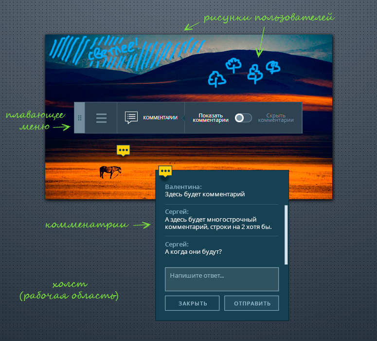
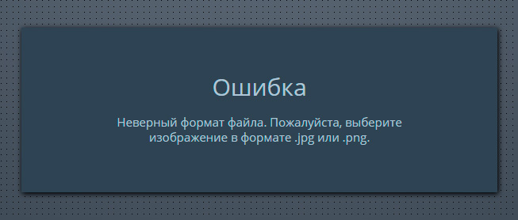
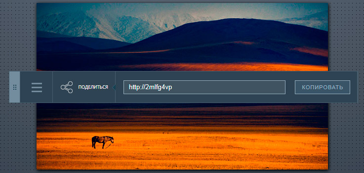
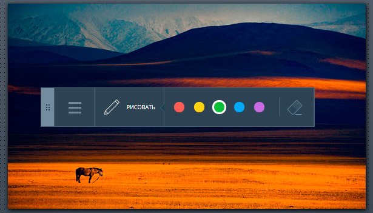
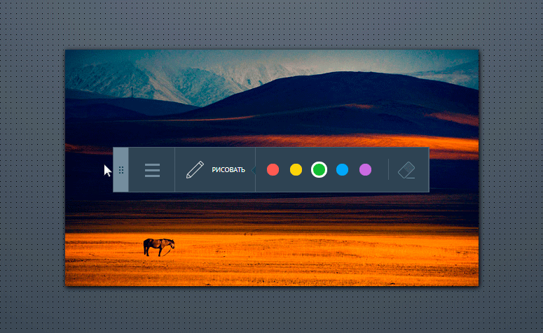
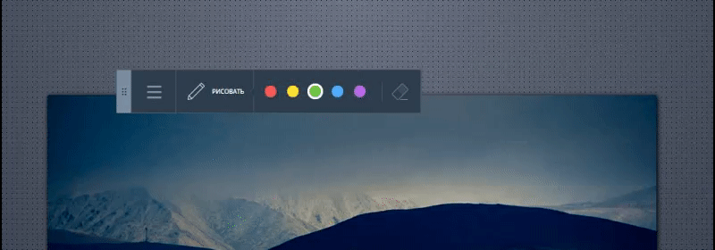

Дипломный проект курса «JavaScript в браузере»
===

В рамках дипломного проекта вам необходимо реализовать клиентскую часть сервиса, позволяющего рецензировать изображения.

Сервис предоставляет пользователям следующие возможности:
- загружать изображения;
- добавлять комментарии к конкретной части изображения;
- рисовать поверх изображения.

А также сервис наделен элементами совместной работы:
- загруженное изображение имеет уникальную ссылку, которой можно поделиться;
- все пользователи, просматривающие изображение, уведомляются о новых комментариях к нему;
- все пользователи, просматривающие изображение в режиме рисования, видят, что рисуют другие пользователи.

## Интерфейс

Приложение имет два состояния:

1. Публикация (_состояние по умолчанию_):


2. Рецензирование:


Приложение имеет четыре компонента:
- _Холст_, основная рабочая область, в которой располагаются рецензируемое изображение и плавающее меню;
- _Плавающее меню_, позволяющее переключаться между режимами и инструментами;
- _Маска со штрихами пользователей_, созданными в режиме **Рисование**;
- _Комментарии пользователей_, оставленные в режиме **Комментирование**.

Компоненты обозначены на рисунке ниже:



### Публикация

Этот режим открывается по умолчанию при открытии интерфейса: 


В нём доступна всего одна функция: выбор изображения и его публикация на сервере. Изображение можно выбрать двумя способами:

1. Кликнуть на поле «Загрузить новое», после чего откроется стандартный диалог выбора файла. Выбор ограничен только JPG и PNG изображениями.
2. Перетащить файл изображения и бросить на холст. 

В обоих случаях, сразу после успешного выбора изображения, оно публикуется на сервере. 

Пока изображение загружается на сервер, должен отображаться прелоадер:


В случае успеха интерфейс переходит в состояние **Рецензирование**, режим «Поделиться».

Успешно загруженное изображение должно оставаться на холсте при обновлении страницы браузера. При этом, если открыть приложение заново (не по ссылке из «Поделиться») в том же окне, должен отображаться чистый холст.


#### Ошибки при публикации

Если на холст брошена не картинка, либо картинка в другом формате (не JPG и PNG), должно появиться сообщение об ошибке:



Если при публикации возникает какая-либо другая ошибка, также необходимо сообщить о ней пользователю. При этом, у пользователя остаётся возможность попробовать загрузить выбранное изображение повторно, либо выбрать другое изображение.

После успешной загрузки и отображения изображения на холсте, последующие изображения, брошенные на холст или на имеющееся изображение, должны быть проигнорированы, а пользователю должно быть показано сообщение с рекомендацией воспользоваться опцией «Загрузить новое» в меню:


### Рецензирование

В состояние **Рецензирование** интерфейс переходит после успешной загрузки изображения:



В это состояние возможно попасть двумя способами:
1. После успешной публикации изображения открывается режим «Поделиться» (_описано в состоянии «Публикация»_).
2. При переходе по ссылке скопированной из режима «Поделиться» открывается режимы «Комментирование» (_будет описан ниже_).

В данном состоянии **Рецензирования** доступно три режима: комментирование, рисование, поделиться. Всегда активен один из этих трёх режимов. Вариант, когда все режимы не активны считается ошибкой.

#### Режим «Комментирование»

Режим открывается при переходе по ссылке полученной в режиме «Поделиться». А так же при клике на пункт «Комментарии» в меню. В этом режиме можно добавлять новые комментарии.

Доступен переключатель, позволяющий показать или скрывать маркеры комментариев.


По умолчанию, маркеры отображаются. И при появлении нового комментария, добавленного другим пользователем, его маркер должен тоже необходимо отобразить. Маркеры отображаются во всех режимах. При клике на каждый маркер открывается окно с комментарием / цепочкой комментариев и формой для отправки нового комментария:


Если в меню выбрать «Скрыть комментарии», то маркеров комментариев не видно:


Это может потребоваться, например, чтобы маркеры не мешали рисовать (_режим «Рисование»_). Маркеры комментариев можно вернуть только выбрав в меню «Показать комментарии». Если комментарии скрыты, то при появлении комментария, который добавил другой пользователь, его маркер не должен появляться. 

При клике в любую точку на холсте, открывается форма добавления нового комментария. Она не должна скрываться при клике на маркер. При добавления нового комментария необходимо показать прелоадер на время, пока данные не будут отправлены:


Одновременно может быть показана только один блок комментариев, либо форма добавления нового комментария. Открытый ранее блок комментария или форма должны скрываться. Форма добавления комментария не должна оставлять маркер при скрытии.

#### Режим «Рисование»



Здесь доступна возможность выбора цвета пера из пяти доступных: 
- красный (`#ea5d56`), 
- жёлтый (`#f3d135`), 
- зелёный (`#6cbe47`), 
- синий (`#53a7f5`) 
- и фиолетовый (`#b36ade`).


Толщина пера постоянна (`4px`). Рисунки отображаются и в других режимах.

#### Режим «Поделиться»


Открывается сразу после публикации. Тут доступна ссылка, перейдя по которой приложение откроется и сразу перейдет в состояние «Рецензироние» именно с этим изображением.

#### Переключение между режимами

Для переключения между режимами пользователю доступно плавающее меню. Меню можно переместить в любую часть холста, если зажать кнопку мыши на «корешке». Перемещённое меню должно сохранять своё положение при обновлении страницы.

При перемещении меню не должно выходить за границы экрана:



Раскрыть меню и выбрать другие режимы можно, кликнув на поле «бургер-меню». Переключение осуществляется следующим образом:



При переключении режимов также есть возможность вернуться в состояние **Публикация**.

Меню всегда должно отражать текущее состояние и режим приложения. Если мы в состоянии **Публикация**, то поле «бургер-меню» не отображается, так как доступен только один пункт. Если мы в состоянии **Рецензирование**, то выбран один из режимов, остальные скрыты в поле «бургер-меню».

## Взаимодействие с сервером по HTTP

Для взаимодействии с серверной частью приложения вам доступно REST API по адресу:

https://neto-api.herokuapp.com

### Добавление изображения

`POST /pic` — позволяет опубликовать на сервере новое изображение.

Формат данных при отправке `multipart/form-data`. Поля:

- `title` — название изображения, _строка_
- `image` - изображение, _файл_

В ответ приходит либо сообщение об ошибке, либо JSON-объект с данными о изображении. Например:
```json
{
  "id": "aba23fc0-1008-11e8-b8b2-2b0fbff0de7d",
  "title": "Макет дизайна",
  "url": "https://storage.googleapis.com/neto-api.appspot.com/pic/aba23fc0-1008-11e8-b8b2-2b0fbff0de7d/bMFAlDwf9AI.jpg",
  "timestamp": 1518449006013
}
```

Тут:
- `id` — идентификатор изображения на сервере, _строка_;
- `title` — название изображения, которое передано при создании, _строка_;
- `url` — URL-адрес изображения, по которому оно доступно в сети, _строка_;
- `timestamp` — время публикации изображения, _число_.

### Получение информации об изображении

`GET /pic/${id}` — получить информацию об изображении в JSON-формате. Тут `${id}` — идентификатор изображения на сервере.

В ответ приходит либо сообщение об ошибке, либо JSON-объект с данными об изображении. Например:
```json
{
  "id": "aba23fc0-1008-11e8-b8b2-2b0fbff0de7d",
  "title": "Макет дизайна",
  "url": "https://storage.googleapis.com/neto-api.appspot.com/pic/aba23fc0-1008-11e8-b8b2-2b0fbff0de7d/bMFAlDwf9AI.jpg",
  "mask": "https://www.googleapis.com/download/storage/v1/b/neto-api.appspot.com/o/pic%2F8ece7a20-15f4-11e8-96fd-2513ea9afcae-mask.png?generation=1519100719825524&alt=media",
  "timestamp": 1518449006013,
  "comments": {
    "-L59YakIzQIO4_qiP6ws": {
      "left": 100,
      "message": "Тут мне кажется лучше подойдет розовый цвет",
      "timestamp": 1518448045157,
      "top": 65
    },
    "-L59bM_rv4fesvnQ1nts": {
      "left": 953,
      "message": "Эта картинка на коллаже слишком шумная",
      "timestamp": 1518449031562,
      "top": 480
    }
  },
}
```

Кроме полей, которые были уже описаны при создании изображения, тут может быть доступно еще два необязательных свойства с ключами:
- `mask` — информация о маске изображения, (_строка_, может отстутствовать);
- `comments` — справочник комментариев с уникальными ключами, (_объект_, может отстутствовать).

Свойство `comments`, которое хранит справочник комментариев с уникальными ключами. Каждый комментарий имеет следующие свойства:
- `message` — текст комментария, _строка_.
- `left` — расстояние по горизонтальной оси X от левого края изображения, _число_;
- `top` — расстояние по вертикальной оси Y от верхнего края изображения, _число_;
- `timestamp` — время публикации комментария, _число_.

Ключ является индентификатором комментария.

### Добавление комментария к изображению

`POST /pic/${id}/comments` — позволяет добавить комментарий к изображению с идентификатором `${id}` на сервере.

Формат данных при отправке `application/x-www-form-urlencoded`. Поля:
- `message` — текст комментария, _строка_.
- `left` — расстояние по горизонтальной оси X от левого края изображения, _число_;
- `top` — расстояние по вертикальной оси Y от верхнего края изображения, _число_.

В ответ приходит либо сообщение об ошибке, либо JSON-объект с обновленными данными об изображении (см. _Получение информации об изображении_).

## Взаимодействие с сервером через веб-сокет

Для обновления интерфейса в «реальном» времени дополнительно реализован веб-сокет сервер, принимающий запросы на соединение по адресу:

wss://neto-api.herokuapp.com/pic/${id}

Тут `${id}` это идентификатор изображения. Таким образом, по соединению передаётся только информация, связанная с этим изображением.

Сервер передаёт информацию о возникших событиях в формате JSON. Поэтому для простоты будем называть эту информацию событиями. Общий формат события следующий:
```json
{
  "event": "comment",
  "comment": {
    "id": "-L5lSlx4chCJMqo36iLe",
    "left": 313,
    "message": "Вот тут можно добавить цифру 777",
    "timestamp": 1519100829532,
    "top": 298
  }
}
```

При этом свойство с ключом `event` общее для всех событий. Оно содержит тип события (_строка_, например, `comment`). Остальные свойства полностью зависят от типа события.

### Информация об изображении

Событие `pic` наступает сразу после установки соединения.

Событие содержит информацию об изображении в свойстве с ключом `pic` (смотрите раздел _Получение информации об изображении_).

### Новый комментарий

Событие `comment` наступает после того, как кто-либо из пользователей добавил комментарий к текущему изображению. В том числе и у того пользователя, который его добавил.

Событие содержит свойство с ключом `comment`, в котором содержится информация о комментарии в виде объекта (смотрите раздел _Получение информации об изображении_).

### Обновилась маска

Событие `mask` наступает после того, как кто-либо из пользователей обновил маску текущего изображения. Событие возникает в том числе и у того пользователя, который обновил маску.

Событие содержит свойство c ключом `url`, в котором доступен URL-адрес нового изображения маски (_строка_).

### Ошибка

Событие `error` наступает при возникновении каких-либо ошибок на сервере, и, в основном, связано с действиями пользователя сервиса.

Событие содержит свойство с ключом `message`, в котором доступно описание ошибки (_строка_).

### Обновление маски

Кроме того, веб-сокет сервер принимает от клиента бинарные данные и ожидает, что эти данные представляют собой изображение в формате PNG. В случае успеха, сервер интерпретирует это изображение как полноразмерный фрагмент маски, пытается склеить его с текущей маской и обновить текущую маску. В случае успеха сервер посылает событие `mask` с URL-адресом новой маски. В случае неудачи событие `error` с описанием ошибки.

## Стратегия реализации коллективного рисования

Первое, что нужно понять, рисование осуществляется не на самом изображении, а на прозрачной маске.

Дополнительно нужно отделить то, что рисует ваш пользователь от того, что рисуют или уже нарисовали другие пользователи на маске текщего изображения. Поэтому, вы также не изменяете само изображение маски, которое доступно в свойстве `mask` изображения. Его необходимо показывать поверх изображения, и обновлять по событию `mask`.

Сам пользователь рисует непосредственно на `canvas`, данные которого периодически преобразуются в бинарные и отправляются на сервер. После чего холст необходимо очистить.

### Обновление маски

У вас не стоит задачи реализовать полный режим «реального» времени. Поэтому ряд предостережений:
- Не отправляйте данные холста на сервер слишком часто. Максимальная частота обновлений 1 секунда.
- Не отправляйте данные маски изображения. Они уже есть на сервере.
- Не отправляйте данные, которые уже были отправлены ранее. Продумайте такую архитектуру, при которой уже нарисованные и отправленные на сервер штрихи не будут отправляться повторно.
- Не отправляйте данные, которые не изменились с прошедшей отправки. Т.е. не отправляйте пустой холст, либо холст на котором те же штрихи, которые уже были отправлены.

## Требования к реализации

- Недопустимо использовать сторонние библиотеки. В том числе jQuery, underscore и другие.
- Код должен соответствовать [стилю оформления](https://netology-university.bitbucket.io/codestyle/), принятому в Нетологии.

### Как правильно задавать вопросы дипломному руководителю?
Что следует делать, чтобы все получилось:

1. Попробовать найти ответ сначала самому в интернете. Ведь, именно это скилл поиска ответов пригодится тебе на первой работе. И только после этого спрашивать дипломного руководителя
2. В одном вопросе должна быть заложена одна проблема
3. По возможности, прикреплять к вопросу скриншоты и стрелочкой показывать где не получается. Программу для этого можно скачать здесь https://app.prntscr.com/ru/
4. По возможности, задавать вопросы в комментариях к коду. Начинать работу над дипломом как можно раньше! Чтобы было больше времени на правки.
5. Делать диплом по-частям, а не все сразу. Иначе, есть шанс, что нужно будет все переделывать :)

Что следует делать, чтобы ничего не получилось:

1. Писать вопросы вида “Ничего не работает. Не запускается. Всё сломалось.”
2. Откладывать диплом на потом.
3. Ждать ответ на свой вопрос моментально. Дипломные руководители - работающие разработчики, которые занимаются, кроме преподавания, своими проектами. Их время ограничено, поэтому постарайтесь задавать правильные вопросы, чтобы получать быстрые ответы!
